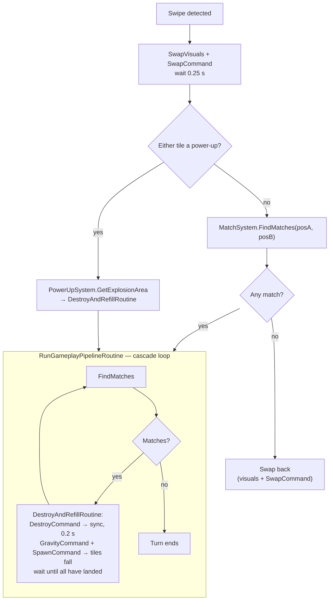

# Puzzle Up! — Architecture

A match-3 puzzle prototype built in Unity. The code lives in a single namespace root, `Match3Engine`, and is organised around one idea: **the board state is plain data, and the view only mirrors it**.

| | |
|---|---|
| Unity version | 6000.3.10f1 (Unity 6) |
| Render pipeline | Built-in, 2D feature set |
| Input | New Input System package (`com.unity.inputsystem` 1.18.0), polled directly |
| Assemblies | Everything compiles into `Assembly-CSharp` (no `.asmdef` files) |
| Code size | 16 scripts, ~920 lines |
| Scene | `Assets/Scenes/SampleScene.unity` (the only scene in the build) |

## 1. Project layout

```
Assets/
├── Scenes/SampleScene.unity      Single gameplay scene
├── Prefabs/TilePrefab.prefab     One tile: SpriteRenderer + TileView
├── Sprites/                      Two sliced sprite sheets (colour tiles, power-ups)
├── Scripts/
│   ├── Core/                     Data model + orchestrator
│   │   ├── TileType.cs           Enum of colours and power-ups
│   │   ├── BoardModel.cs         The grid (pure C#)
│   │   └── GameController.cs     MonoBehaviour that wires and drives everything
│   ├── Commands/                 Board mutations as ICommand objects
│   │   ├── ICommand.cs
│   │   ├── SwapCommand.cs
│   │   ├── DestroyCommand.cs
│   │   ├── GravityCommand.cs
│   │   └── SpawnCommand.cs
│   ├── Systems/                  Game rules (pure C#, except InputSystem)
│   │   ├── CommandSystem.cs      FIFO command queue
│   │   ├── MatchSystem.cs        Match detection + power-up creation rules
│   │   ├── GravitySystem.cs      Column collapse
│   │   ├── SpawnSystem.cs        Random refill
│   │   ├── PowerUpSystem.cs      Explosion area calculation
│   │   └── InputSystem.cs        MonoBehaviour: swipe → swap request
│   ├── View/                     Presentation
│   │   ├── BoardView.cs          Grid of TileViews, camera fitting
│   │   └── TileView.cs           One sprite, lerps to a target position
│   └── AI/                       Empty (placeholder)
├── Levels/                       Empty (placeholder)
├── InputSystem_Actions.inputactions   Unity default asset; not used by game code
└── _Recovery/0.unity             Unity crash-recovery scene, not part of the game
```

## 2. Layers

```mermaid
flowchart TD
    Input["InputSystem<br/>(MonoBehaviour)"] -->|ProcessPlayerSwap(a, b)| GC

    subgraph Core
        GC["GameController<br/>(MonoBehaviour, orchestrator)"]
        BM["BoardModel<br/>TileType[,] grid"]
    end

    subgraph Systems
        CS[CommandSystem]
        MS[MatchSystem]
        GS[GravitySystem]
        SS[SpawnSystem]
        PS[PowerUpSystem]
    end

    subgraph Commands
        CMD["Swap / Destroy / Gravity / Spawn<br/>(ICommand)"]
    end

    subgraph View
        BV[BoardView] --> TV["TileView × (W×H)"]
    end

    GC -->|enqueue + process| CS --> CMD
    CMD -->|write| BM
    GC -->|query| MS
    GC -->|query| PS
    MS -->|read| BM
    PS -->|read| BM
    GS -->|write| BM
    SS -->|write| BM
    CMD --> GS
    CMD --> SS
    GC -->|SyncVisualsWithData / SwapVisuals| BV
    BV -->|read| BM
```

Dependency rules that the code currently follows:

- **`BoardModel` depends on nothing** but `TileType`. It has no Unity types and no knowledge of views or systems.
- **Systems and commands are plain C# classes** that receive the `BoardModel` through their constructor. Only `InputSystem` is a `MonoBehaviour`.
- **The view never writes to the model.** `BoardView` reads the model and repaints; all mutations go through commands.
- **`GameController` is the only class that knows about every layer.** It is the composition root (creates the model and systems in `Start`) and the turn sequencer (coroutines).

## 3. Core

### `TileType`
One enum covers both tile families, and their order matters:

- `None` — empty cell
- `Red, Blue, Green, Yellow, Purple, Pink` — base colours. `MatchSystem.IsBaseColor` relies on these being the contiguous range `Red..Pink`.
- `RocketHorizontal, RocketVertical, TNT, ColorBomb` — power-ups

### `BoardModel`
A `TileType[width, height]` grid with bounds-safe accessors. `GetTile` returns `None` for out-of-range coordinates and `SetTile` silently ignores them, so systems can probe neighbours without their own bounds checks.

Coordinates are `(x, y)` with `(0, 0)` at the **bottom-left**; `y` increases upward. Grid coordinates equal world coordinates — tile `(x, y)` is drawn at world position `(x, y)` with one unit per cell. Input and the camera both depend on this.

### `GameController`
Inspector-configured: board size, `availableTileTypes` (what can spawn), a `BoardView` reference and a `TileType → Sprite` table (`TileSpriteMapping[]`).

`Start()` builds the model and the five systems, asks the view to instantiate the tile grid and fit the camera, fills the board with `SpawnSystem.SpawnTiles()` and does a first visual sync.

## 4. Turn flow

`InputSystem` calls `GameController.ProcessPlayerSwap(posA, posB)`, which starts `SwapAndProcessRoutine`:



`DestroyAndRefillRoutine` is shared by the match and power-up paths. After clearing, it runs gravity and spawn back to back on the model and hands their results (`GravitySystem.LastMoves`, `SpawnSystem.LastSpawned`) to the view, so surviving tiles and new tiles fall at the same time. It then waits on `BoardView.IsDropping` rather than a fixed delay.

`GameController` holds an `isBusy` flag for the whole turn: `ProcessPlayerSwap` ignores swipes while it is set, and also rejects swaps where either cell is off the board.

The cascade loop runs until a full pass finds no matches. The swap positions are only passed on the **first** pass; later passes use `(-1, -1)` so that power-ups created by chain reactions are placed by shape rather than by player touch.

### Command pattern
Every board mutation is an `ICommand` with a single `Execute()` method. `CommandSystem` holds a `Queue<ICommand>`; `GameController` always enqueues one command and immediately calls `ProcessNextCommand()`, so the queue is never more than one deep. The pattern is in place as a seam (for replay, undo, or deferred execution) rather than being exploited today — `ICommand` has no `Undo`, and an invalid swap is reverted by issuing a second `SwapCommand`.

| Command | Effect on the model |
|---|---|
| `SwapCommand` | Exchanges two cells |
| `DestroyCommand` | Sets every matched cell to `None`, then writes any power-ups from `MatchResult.specialsToCreate` |
| `GravityCommand` | Delegates to `GravitySystem.ApplyGravity()` |
| `SpawnCommand` | Delegates to `SpawnSystem.SpawnTiles()` |

## 5. Systems

### `MatchSystem`
`FindMatches(swapPosA, swapPosB)` scans the **whole board** and returns a `MatchResult`:

- `matchedTiles` — every cell to clear
- `specialsToCreate` — `position → power-up type` to place after clearing

Steps:

1. **Horizontal runs** of 3+ identical base colours, row by row.
2. **Vertical runs** of 3+, column by column.
3. **Merge** any runs that share a cell, repeated until stable. This is what turns a crossing row and column into a single L/T group.
4. **Classify** each merged group by its tile count and bounding box:

| Group | Result |
|---|---|
| 3 tiles | Clear only |
| 4 in a row | `RocketHorizontal` |
| 4 in a column | `RocketVertical` |
| 5+ tiles, bounding box narrower than 5 (L / T shape) | `TNT` |
| 5+ tiles, 5 or more in a straight line | `ColorBomb` |

5. **Place** the power-up: at the swapped cell if it is in the group; otherwise (cascades) at the cell with the most in-group neighbours, i.e. the intersection.

Power-up tiles are never part of a match (`IsBaseColor` filters them out).

### `PowerUpSystem`
`IsPowerUp(type)` and `GetExplosionArea(pos, type, swappedColor)`, which returns the set of cells to destroy:

| Power-up | Area |
|---|---|
| `RocketHorizontal` | Entire row |
| `RocketVertical` | Entire column |
| `TNT` | 3×3 around the tile, clamped to the board |
| `ColorBomb` | Every tile of the type it was swapped with |

Power-ups are activated **only by swapping them**. `GameController` unions the areas of both swapped tiles and wraps them in a `MatchResult` so the regular `DestroyCommand` can be reused.

### `GravitySystem`
For each column, bottom to top: for every empty cell, pull down the nearest non-empty tile above it. Operates in place on the model and records each fall as a `TileMove { from, to }` in `LastMoves`, in the order it happened.

### `SpawnSystem`
Fills every remaining `None` cell with a uniformly random entry from `availableTileTypes` (uses `UnityEngine.Random`, unseeded) and records the filled cells in `LastSpawned`, column by column from bottom to top.

### `InputSystem`
Polls `Mouse.current` and `Touchscreen.current` each frame. Press and release positions are converted to world space; if the drag is longer than `0.5` units, the start position is rounded to a grid cell and the dominant axis of the drag picks the neighbour. Result: `gameController.ProcessPlayerSwap(posA, posB)`.

Note the class shares its name with the `UnityEngine.InputSystem` namespace; it resolves correctly because it lives in `Match3Engine.Systems`.

## 6. View

### `BoardView`
- `InitializeBoard(model)` — instantiates one `TilePrefab` per cell under the `Board` transform and stores them in a `TileView[,]` that mirrors the model. Also creates a `SpriteMask` the size of the board at runtime and sets every tile to `VisibleInsideMask`, so tiles waiting above the board are hidden until they fall into it.
- `SyncVisualsWithData(getSprite)` — full repaint: every `TileView` gets the sprite for the model's type at its slot. Called for the initial fill and after each destroy step.
- `DropTiles(moves)` — replays the gravity pass: for each `TileMove`, the falling view and the empty (sprite-less) view below it exchange slots in the array, and the falling view drops to its new cell.
- `DropNewTiles(spawned, getSprite)` — reuses the empty views left at the top of each column: gives each its new sprite, stacks it above the board (`y = Height + n`), and drops it into its cell.
- `IsDropping` — true while any tile is still falling.
- `SwapVisuals(a, b)` — exchanges two `TileView` references and retargets them, which is what produces the swap animation.
- `CenterAndScaleCamera(w, h)` — centres the orthographic camera on the board and sizes it to fit with 2 units of padding, whichever of width or height is tighter.

### `TileView`
Holds a `SpriteRenderer`. `UpdateVisuals` assigns the sprite and rescales it to fit 0.95 of a cell regardless of source size. It has two ways of moving:

- `MoveToPosition` — `Update` lerps toward the target every frame. Used for swaps.
- `DropToPosition` — falls straight down with constant acceleration (50 units/s², capped at 25 units/s) and stops exactly on the target. Used for gravity and spawns.

`SnapToPosition` teleports with no animation. Views are never destroyed or instantiated after start-up: a cleared tile's view keeps its place in the array with no sprite and is reused for the next spawn. Clearing itself is still an instant sprite removal.

## 7. Scene wiring

`SampleScene` has three root objects:

| GameObject | Components | Notes |
|---|---|---|
| `Main Camera` | Camera | Repositioned and resized at runtime by `BoardView` |
| `GameManager` | `GameController`, `BoardView`, `InputSystem` | All references are wired in the Inspector |
| `Board` | Transform only | Parent for instantiated tiles |

Scene values on `GameController`:

- Board is **10 × 10** (the script default is 8 × 8).
- `availableTileTypes`: Red, Green, Blue, Yellow, Pink. `Purple` exists in the enum but is not spawned and has no sprite.
- `tileSprites`: nine mappings — the five colours above plus the four power-ups.

## 8. Known limitations

Behaviours visible in the current code that are worth knowing before extending it:

1. **The starting board can contain matches.** Initial fill is purely random. Since `FindMatches` scans the entire board, a pre-existing match makes *any* first swap count as valid.
2. **Swap validity is board-wide.** For the same reason, a swap is accepted if a match exists anywhere, not only if the swapped tiles took part in one.
3. **Power-ups do not chain.** A power-up caught in another explosion is simply removed without firing.
4. **ColorBomb + power-up** destroys only tiles of that power-up's type, since the swapped tile's type is used as the target "colour".
5. **No deadlock detection or shuffle** when no moves remain.
6. **No game layer yet** — no score, move counter, goals, levels, UI, audio or persistence. `Assets/Levels` and `Assets/Scripts/AI` are empty.
7. **No tests**, although the Test Framework package is installed. The pure-C# model and systems are testable as they stand, apart from `SpawnSystem`'s use of `UnityEngine.Random`.

## 9. Extension points

- **New tile colour** — add it inside the `Red..Pink` range of `TileType`, then add it to `availableTileTypes` and `tileSprites` in the Inspector.
- **New power-up** — add the enum value after the colours, extend `PowerUpSystem.IsPowerUp` / `GetExplosionArea`, add a creation rule in `MatchSystem`, and map a sprite.
- **New board action** — implement `ICommand` and run it from `GameController` through `CommandSystem`.
- **Levels** — `GameController` already takes board size and tile set as data; a level asset would supply those in place of Inspector values.

## 10. Version control

The project root is a git repository on branch `main`, with `origin` at `github.com/itu-itis25-baydarb21/PuzzleUp`. `Assets/`, `Packages/` and `ProjectSettings/` are tracked; `Library/`, `Temp/`, `Logs/`, `UserSettings/` and generated solution/project files are excluded by the standard Unity `.gitignore`.
