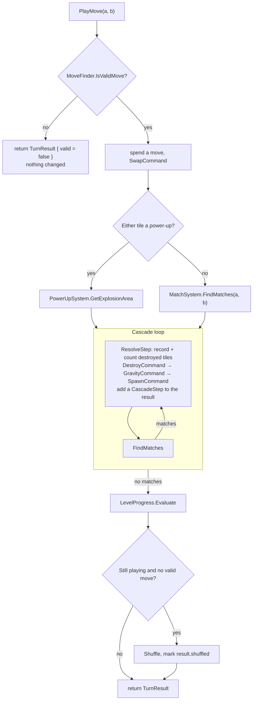

# Puzzle Up! — Architecture

A match-3 puzzle prototype built in Unity. The code lives in a single namespace root, `Match3Engine`, and is organised around one idea: **the game is plain data that resolves instantly, and the view only replays what happened**.

| | |
|---|---|
| Unity version | 6000.3.10f1 (Unity 6) |
| Render pipeline | Built-in, 2D feature set |
| Input | New Input System package (`com.unity.inputsystem` 1.18.0), polled directly |
| Assemblies | `Match3Engine` (all game code, `Assets/Scripts`) and `Match3Engine.Tests.EditMode` (`Assets/Tests/EditMode`) |
| Tests | 7 edit-mode tests that run whole games with no scene |
| Scene | `Assets/Scenes/SampleScene.unity` (the only scene in the build) |

## 1. Project layout

```
Assets/
├── Scenes/SampleScene.unity      Single gameplay scene
├── Prefabs/TilePrefab.prefab     One tile: SpriteRenderer + TileView
├── Sprites/                      Two sliced sprite sheets (colour tiles, power-ups)
├── Scripts/
│   ├── Match3Engine.asmdef       Assembly for all game code
│   ├── Core/                     Data model + on-screen controller
│   │   ├── TileType.cs           Enum of colours and power-ups
│   │   ├── BoardModel.cs         The grid (pure C#)
│   │   ├── LevelData.cs          ScriptableObject: board size, colours, move limit, goals
│   │   ├── LevelProgress.cs      Moves left, goal progress, won/lost (pure C#)
│   │   └── GameController.cs     MonoBehaviour that animates one level on screen
│   ├── Commands/                 Board mutations as ICommand objects
│   │   ├── ICommand.cs
│   │   ├── SwapCommand.cs
│   │   ├── DestroyCommand.cs
│   │   ├── GravityCommand.cs
│   │   └── SpawnCommand.cs
│   ├── Systems/                  Game rules (pure C#, except InputSystem)
│   │   ├── CommandSystem.cs      FIFO command queue
│   │   ├── MatchSystem.cs        Match detection + power-up creation rules
│   │   ├── GravitySystem.cs      Column collapse
│   │   ├── SpawnSystem.cs        Seeded random refill and match-free starting fill
│   │   ├── MoveFinder.cs         Which swaps are valid
│   │   ├── PowerUpSystem.cs      Explosion area calculation
│   │   └── InputSystem.cs        MonoBehaviour: swipe → swap request
│   ├── Simulation/               A whole game with no visuals (pure C#)
│   │   ├── GameSimulation.cs     Resolves a full move instantly; owns board, progress, systems
│   │   └── TurnResult.cs         What a move did, as steps the view can replay
│   ├── View/                     Presentation
│   │   ├── BoardView.cs          Grid of TileViews, camera fitting
│   │   ├── TileView.cs           One sprite, lerps to a target position
│   │   └── LevelHud.cs           Moves, goals and result text (uGUI + TextMesh Pro)
│   └── AI/                       Empty (placeholder)
├── Tests/EditMode/               GameSimulationTests + test assembly definition
├── Levels/Level_01.asset         The level the scene loads
├── TextMesh Pro/                 TMP essential resources (imported package content)
├── InputSystem_Actions.inputactions   Unity default asset; not used by game code
└── _Recovery/0.unity             Unity crash-recovery scene, not part of the game
```

## 2. Layers

```mermaid
flowchart TD
    Input["InputSystem<br/>(MonoBehaviour)"] -->|ProcessPlayerSwap(a, b)| GC
    Bots["Bots, tests<br/>(no scene needed)"] -->|PlayMove(a, b)| SIM

    GC["GameController<br/>(MonoBehaviour)"] -->|PlayMove(a, b)| SIM
    SIM -->|TurnResult| GC
    GC -->|replay steps| BV

    subgraph Simulation [Simulation — pure C#]
        SIM[GameSimulation]
        SIM --> CS[CommandSystem] --> CMD["Swap / Destroy / Gravity / Spawn<br/>(ICommand)"]
        SIM -->|query| MF[MoveFinder]
        SIM -->|query| MS[MatchSystem]
        SIM -->|query| PS[PowerUpSystem]
        CMD --> GS[GravitySystem]
        CMD --> SS[SpawnSystem]
        CMD -->|write| BM["BoardModel"]
        SIM --> LP[LevelProgress]
    end

    subgraph View
        BV[BoardView] --> TV["TileView × (W×H)"]
        HUD[LevelHud]
    end

    GC --> HUD
```

Dependency rules that the code currently follows:

- **`GameSimulation` is the game.** It owns the board, the progress, the systems and the random generator, and never touches a `MonoBehaviour`, a scene or a frame. Anything that can call `PlayMove` can play: the on-screen controller, a test, or a bot.
- **A move resolves completely before anything is drawn.** `PlayMove` returns a `TurnResult` describing what happened; the board is already in its final state.
- **The view replays, it does not decide.** `BoardView` is told which tiles were destroyed, which fell and which spawned. It only reads the model directly for a full repaint (start of level, after a shuffle).
- **One seed, one game.** All randomness comes from a single `System.Random` created from the seed, so the same level, seed and moves always give the same result.

## 3. Core

### `TileType`
One enum covers both tile families, and their order matters:

- `None` — empty cell
- `Red, Blue, Green, Yellow, Purple, Pink` — base colours. `MatchSystem.IsBaseColor` relies on these being the contiguous range `Red..Pink`.
- `RocketHorizontal, RocketVertical, TNT, ColorBomb` — power-ups

### `BoardModel`
A `TileType[width, height]` grid with bounds-safe accessors. `GetTile` returns `None` for out-of-range coordinates and `SetTile` silently ignores them, so systems can probe neighbours without their own bounds checks.

Coordinates are `(x, y)` with `(0, 0)` at the **bottom-left**; `y` increases upward. Grid coordinates equal world coordinates — tile `(x, y)` is drawn at world position `(x, y)` with one unit per cell. Input and the camera both depend on this.

### `LevelData`
A `ScriptableObject` (create via **Assets → Create → Puzzle Up → Level**) holding everything that defines a level: `width`, `height`, `availableTileTypes`, `moveLimit`, and `goals` — a list of `LevelGoal { type, amount }`, each meaning "destroy this many tiles of this colour".

### `LevelProgress`
Plain C# state for one attempt: `MovesLeft`, the remaining count per goal colour, and `State` (`Playing`, `Won`, `Lost`).

- `UseMove()` — called for every swap that does something. A swap that is reverted costs nothing.
- `Collect(type)` — called for every tile destroyed, by a match or a power-up.
- `Evaluate()` — called once the board has settled after a move: `Won` if every goal is complete, otherwise `Lost` if no moves remain. A goal completed on the last move is a win.

### `GameController`
Inspector-configured: the `LevelData` to play, a `seed` (0 means a new one every run), a `BoardView` and `LevelHud` reference, and a `TileType → Sprite` table (`TileSpriteMapping[]`).

`Start()` creates a `GameSimulation` for the level, asks the view to instantiate the tile grid and fit the camera, and paints the starting board.

It keeps its own `LevelProgress` for what is **shown on screen**. The simulation's progress is always a full turn ahead of the animation, so the controller advances its copy step by step as each cascade is displayed. Both end every turn with the same values.

## 4. Turn flow

### In the simulation (instant)

`GameSimulation.PlayMove(posA, posB)`:



The swap positions are only passed to `FindMatches` on the first pass; later passes use `(-1, -1)` so that power-ups created by chain reactions are placed by shape rather than by player touch.

A `TurnResult` holds `valid`, `shuffled`, and one `CascadeStep` per cascade. Each step lists `destroyed` (position and the type it had), `specials` (power-ups created), `falls` (`TileMove { from, to }`) and `spawns` (position and type).

**Starting board.** `SpawnSystem.FillWithoutMatches` never places a third tile in a row, and the fill is repeated until `MoveFinder` finds at least one move.

**Shuffle.** When a turn ends with no valid move, the tiles on the board are randomly rearranged until there are no matches and at least one move. If 50 attempts fail, a fresh board is dealt.

### On screen (animated)

`InputSystem` calls `GameController.ProcessPlayerSwap(posA, posB)`, which starts `PlayTurnRoutine`:

1. Call `simulation.PlayMove` — the turn is now decided.
2. Animate the swap (0.25 s). If the result is not valid, animate it back and stop; no move is spent.
3. For each `CascadeStep`: count the destroyed tiles on the HUD, clear them and show any new power-ups (0.2 s), then drop survivors and new tiles together and wait on `BoardView.IsDropping`.
4. If the board was shuffled, repaint it from the model.
5. Evaluate the on-screen progress and show the result if the level ended.

`GameController` holds an `isBusy` flag for the whole turn: `ProcessPlayerSwap` ignores swipes while it is set, rejects swaps where either cell is off the board, and accepts nothing once the level is won or lost.

### Command pattern
Every board mutation is an `ICommand` with a single `Execute()` method. `CommandSystem` holds a `Queue<ICommand>`; `GameSimulation` always enqueues one command and immediately processes it, so the queue is never more than one deep. The pattern is in place as a seam (for replay, undo, or deferred execution) rather than being exploited today — `ICommand` has no `Undo`. The starting fill and the shuffle write to the board directly, not through commands.

| Command | Effect on the model |
|---|---|
| `SwapCommand` | Exchanges two cells |
| `DestroyCommand` | Sets every matched cell to `None`, then writes any power-ups from `MatchResult.specialsToCreate` |
| `GravityCommand` | Delegates to `GravitySystem.ApplyGravity()` |
| `SpawnCommand` | Delegates to `SpawnSystem.SpawnTiles()` |

## 5. Systems

### `MatchSystem`
`FindMatches(swapPosA, swapPosB)` scans the **whole board** and returns a `MatchResult`:

- `matchedTiles` — every cell to clear
- `specialsToCreate` — `position → power-up type` to place after clearing

Steps:

1. **Horizontal runs** of 3+ identical base colours, row by row.
2. **Vertical runs** of 3+, column by column.
3. **Merge** any runs that share a cell, repeated until stable. This is what turns a crossing row and column into a single L/T group.
4. **Classify** each merged group by its tile count and bounding box:

| Group | Result |
|---|---|
| 3 tiles | Clear only |
| 4 in a row | `RocketHorizontal` |
| 4 in a column | `RocketVertical` |
| 5+ tiles, bounding box narrower than 5 (L / T shape) | `TNT` |
| 5+ tiles, 5 or more in a straight line | `ColorBomb` |

5. **Place** the power-up: at the swapped cell if it is in the group; otherwise (cascades) at the cell with the most in-group neighbours, i.e. the intersection.

Power-up tiles are never part of a match (`IsBaseColor` filters them out).

### `PowerUpSystem`
`IsPowerUp(type)` and `GetExplosionArea(pos, type, swappedColor)`, which returns the set of cells to destroy:

| Power-up | Area |
|---|---|
| `RocketHorizontal` | Entire row |
| `RocketVertical` | Entire column |
| `TNT` | 3×3 around the tile, clamped to the board |
| `ColorBomb` | Every tile of the type it was swapped with |

Power-ups are activated **only by swapping them**. `GameController` unions the areas of both swapped tiles and wraps them in a `MatchResult` so the regular `DestroyCommand` can be reused.

### `GravitySystem`
For each column, bottom to top: for every empty cell, pull down the nearest non-empty tile above it. Operates in place on the model and records each fall as a `TileMove { from, to }` in `LastMoves`, in the order it happened.

### `SpawnSystem`
Fills every remaining `None` cell with a uniformly random entry from `availableTileTypes` using the simulation's seeded `System.Random`, and records the filled cells in `LastSpawned`, column by column from bottom to top. `FillWithoutMatches` deals a whole board, skipping any colour that would complete a line of three.

### `MoveFinder`
The single definition of a legal swap, used by the simulation and available to bots. `IsValidMove(a, b)` requires two neighbouring cells on the board and either a power-up among them, or that the swap puts one of the two tiles into a line of three (checked with `MatchSystem.HasMatchAt`, on the model, then undone). `FindValidMoves()` lists every legal swap once; `HasValidMove()` stops at the first.

### `InputSystem`
Polls `Mouse.current` and `Touchscreen.current` each frame. Press and release positions are converted to world space; if the drag is longer than `0.5` units, the start position is rounded to a grid cell and the dominant axis of the drag picks the neighbour. Result: `gameController.ProcessPlayerSwap(posA, posB)`.

Note the class shares its name with the `UnityEngine.InputSystem` namespace; it resolves correctly because it lives in `Match3Engine.Systems`.

## 6. View

### `BoardView`
- `InitializeBoard(model)` — instantiates one `TilePrefab` per cell under the `Board` transform and stores them in a `TileView[,]` that mirrors the model. Also creates a `SpriteMask` the size of the board at runtime and sets every tile to `VisibleInsideMask`, so tiles waiting above the board are hidden until they fall into it.
- `SyncVisualsWithData(getSprite)` — full repaint from the model. Called for the starting board and after a shuffle.
- `ClearTiles(destroyed)` / `PlaceTiles(specials, getSprite)` — remove the sprites of destroyed tiles and show power-ups created in place.
- `DropTiles(moves)` — replays the gravity pass: for each `TileMove`, the falling view and the empty (sprite-less) view below it exchange slots in the array, and the falling view drops to its new cell.
- `DropNewTiles(spawns, getSprite)` — reuses the empty views left at the top of each column: gives each the sprite for its spawned type, stacks it above the board (`y = Height + n`), and drops it into its cell.
- `IsDropping` — true while any tile is still falling.
- `SwapVisuals(a, b)` — exchanges two `TileView` references and retargets them, which is what produces the swap animation.
- `CenterAndScaleCamera(w, h)` — centres the orthographic camera on the board and sizes it to fit with 2 units of padding, whichever of width or height is tighter.

### `TileView`
Holds a `SpriteRenderer`. `UpdateVisuals` assigns the sprite and rescales it to fit 0.95 of a cell regardless of source size. It has two ways of moving:

- `MoveToPosition` — `Update` lerps toward the target every frame. Used for swaps.
- `DropToPosition` — falls straight down with constant acceleration (50 units/s², capped at 25 units/s) and stops exactly on the target. Used for gravity and spawns.

`SnapToPosition` teleports with no animation. Views are never destroyed or instantiated after start-up: a cleared tile's view keeps its place in the array with no sprite and is reused for the next spawn. Clearing itself is still an instant sprite removal.

### `LevelHud`
Sits on the `HudCanvas`. `Refresh(progress)` writes the moves left and each goal's remaining count (or "Done") into two TextMesh Pro labels, and shows a dimmed full-screen panel with "Level Complete!" or "Out of Moves" when the level ends. It only displays what the controller gives it.

## 7. Scene wiring

`SampleScene` has four root objects:

| GameObject | Components | Notes |
|---|---|---|
| `Main Camera` | Camera | Repositioned and resized at runtime by `BoardView` |
| `GameManager` | `GameController`, `BoardView`, `InputSystem` | All references are wired in the Inspector |
| `Board` | Transform only | Parent for instantiated tiles |
| `HudCanvas` | Canvas, CanvasScaler, GraphicRaycaster, `LevelHud` | Screen Space Overlay, scales with screen size (1080×1920 reference). Children: `MovesText`, `GoalsText`, `ResultPanel` → `ResultText` |

`GameController` points at `Assets/Levels/Level_01.asset`:

- Board is **8 × 8**, 20 moves.
- `availableTileTypes`: Red, Green, Blue, Yellow, Pink. `Purple` exists in the enum but is not spawned and has no sprite.
- Goals: 20 Red and 20 Blue.

`tileSprites` on `GameController` has nine mappings — the five colours above plus the four power-ups.

## 8. Known limitations

Behaviours visible in the current code that are worth knowing before extending it:

1. **Power-ups do not chain.** A power-up caught in another explosion is simply removed without firing.
2. **ColorBomb + power-up** destroys only tiles of that power-up's type, since the swapped tile's type is used as the target "colour".
3. **The game layer is minimal** — one level with a move limit and collect goals, and a text HUD. There is no restart or next level (stop and press Play again), no score, audio or persistence. `Assets/Scripts/AI` is empty.
4. **A shuffle is not animated.** The board is simply repainted in its new arrangement.

## 9. Extension points

- **New tile colour** — add it inside the `Red..Pink` range of `TileType`, then add it to `availableTileTypes` and `tileSprites` in the Inspector.
- **New power-up** — add the enum value after the colours, extend `PowerUpSystem.IsPowerUp` / `GetExplosionArea`, add a creation rule in `MatchSystem`, and map a sprite.
- **New board action** — implement `ICommand`, run it from `GameSimulation`, and report its effect in `CascadeStep` so the view can show it.
- **A bot** — construct a `GameSimulation(level, seed)`, pick from `GetValidMoves()`, call `PlayMove`, and repeat until `Progress.State` is no longer `Playing`. No scene is needed.
- **New level** — create a `LevelData` asset and assign it to `GameController.level`.
- **New goal type** — `LevelGoal` only knows "collect a colour"; other goals need a new field there and a rule in `LevelProgress`.

## 10. Version control

The project root is a git repository on branch `main`, with `origin` at `github.com/itu-itis25-baydarb21/PuzzleUp`. `Assets/`, `Packages/` and `ProjectSettings/` are tracked; `Library/`, `Temp/`, `Logs/`, `UserSettings/` and generated solution/project files are excluded by the standard Unity `.gitignore`.
