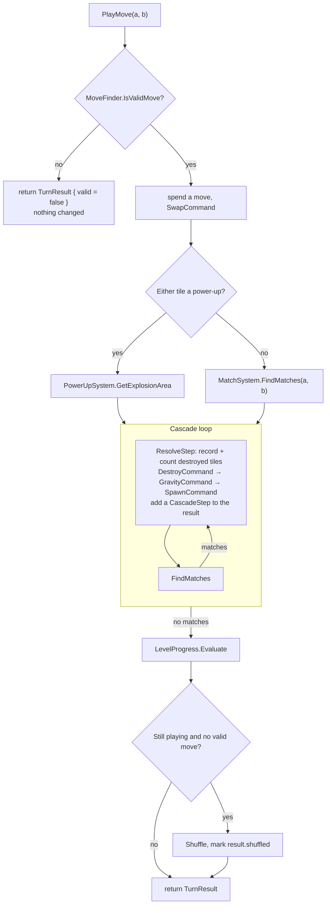
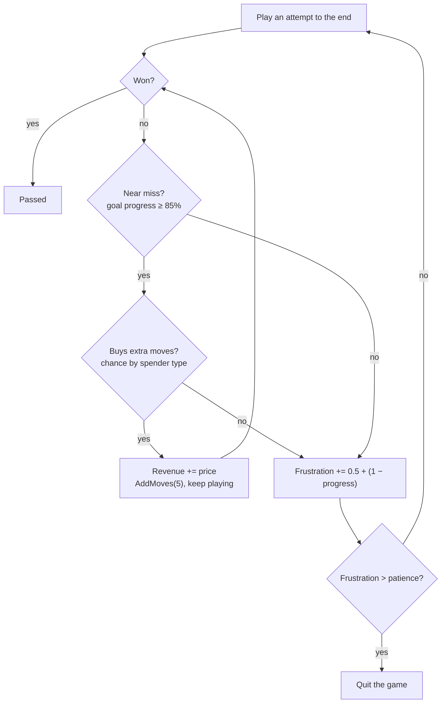

# Puzzle Up! — Architecture

A match-3 studio game built in Unity: the player designs a level, simulated players attempt it, and the level is judged by what it earns and how many players it loses. The code lives in a single namespace root, `Match3Engine`, and is organised around one idea: **the game is plain data that resolves instantly, and the view only replays what happened**.

| | |
|---|---|
| Unity version | 6000.3.10f1 (Unity 6) |
| Render pipeline | Built-in, 2D feature set |
| Input | A bot plays the board. UI buttons use the new Input System (`com.unity.inputsystem` 1.18.0) through `InputSystemUIInputModule` |
| Assemblies | `Match3Engine` (all game code, `Assets/Scripts`), `Match3Engine.Editor` (`Assets/Editor`) and `Match3Engine.Tests.EditMode` (`Assets/Tests/EditMode`) |
| Tests | 37 edit-mode tests that run whole games with no scene |
| Scene | `Assets/Scenes/SampleScene.unity` (the only scene in the build) |

## 1. Project layout

```
Assets/
├── Scenes/SampleScene.unity      Single gameplay scene
├── Prefabs/TilePrefab.prefab     One tile: SpriteRenderer + TileView
├── Sprites/                      Two sliced sprite sheets (colour tiles, power-ups) and Crate.png (placeholder)
├── Scripts/
│   ├── Match3Engine.asmdef       Assembly for all game code
│   ├── Core/                     Data model + on-screen controller
│   │   ├── TileType.cs           Enum of colours, power-ups and obstacles
│   │   ├── BoardModel.cs         The grid (pure C#)
│   │   ├── LevelData.cs          ScriptableObject: board size, colours, obstacles, move limit, goals
│   │   ├── LevelProgress.cs      Moves left, goal progress, won/lost (pure C#)
│   │   └── GameController.cs     MonoBehaviour that animates one level on screen
│   ├── Commands/                 Board mutations as ICommand objects
│   │   ├── ICommand.cs
│   │   ├── SwapCommand.cs
│   │   ├── DestroyCommand.cs
│   │   ├── GravityCommand.cs
│   │   └── SpawnCommand.cs
│   ├── Systems/                  Game rules (pure C#, except InputSystem)
│   │   ├── CommandSystem.cs      FIFO command queue
│   │   ├── MatchSystem.cs        Match detection + power-up creation rules
│   │   ├── GravitySystem.cs      Column collapse
│   │   ├── SpawnSystem.cs        Seeded random refill and match-free starting fill
│   │   ├── MoveFinder.cs         Which swaps are valid
│   │   ├── PowerUpSystem.cs      Explosion area calculation
│   │   └── InputSystem.cs        MonoBehaviour: swipe → swap request (disabled in the scene)
│   ├── Simulation/               A whole game with no visuals (pure C#)
│   │   ├── GameSimulation.cs     Resolves a full move instantly; owns board, progress, systems
│   │   ├── TurnResult.cs         What a move did, as steps the view can replay
│   │   └── MovePreview.cs        What a swap would destroy straight away
│   ├── Players/                  Simulated players: who they are, when they pay, when they quit (pure C#)
│   │   ├── PlayerModelSettings.cs  ScriptableObject with every tunable number; PlayerProfile, SpenderType
│   │   ├── LevelAnalyzer.cs      Runs a population through a level; LevelReport, PlayerPopulation
│   │   └── LevelVerdict.cs       One-line rating of a report
│   ├── Designer/                 The in-game level editor (uGUI)
│   │   ├── LevelDesigner.cs      The designer screen: edit, test, watch
│   │   └── Stepper.cs            A number with minus and plus buttons
│   ├── View/                     Presentation
│   │   ├── BoardView.cs          Grid of TileViews, camera fitting
│   │   ├── TileView.cs           One sprite, lerps to a target position
│   │   ├── LevelHud.cs           Moves, goals and result text (uGUI + TextMesh Pro)
│   │   └── WatchControls.cs      Speed, skip and play-again buttons
│   └── AI/                       Simulated players (pure C#)
│       ├── Bots.cs               IBot, the four strategies, SkillBot, BotFactory
│       ├── BatchRunner.cs        Plays a level many times and collects the results
│       └── BotPlayer.cs          MonoBehaviour: a bot playing the level on screen
├── Editor/                       Menu commands: Puzzle Up > Run Bot Batch, Run Player Model
├── Tests/EditMode/               GameSimulationTests, BotTests, ObstacleTests, PlayerModelTests, LevelVerdictTests + test assembly definition
├── Levels/                       Level_01 (plain board), Level_02 (crates and holes; the one the scene loads), Examples/ (easy, medium, hard)
├── Settings/PlayerModel.asset    The player model's numbers
├── TextMesh Pro/                 TMP essential resources (imported package content)
├── InputSystem_Actions.inputactions   Unity default asset; not used by game code
└── _Recovery/0.unity             Unity crash-recovery scene, not part of the game
```

## 2. Layers

```mermaid
flowchart TD
    LD["LevelDesigner<br/>(MonoBehaviour)"] -->|StartLevel(level)| GC
    LD -->|"SimulatePlayer × population"| PM["LevelAnalyzer<br/>(player model)"]
    PM -->|play attempts| SIM
    BP["BotPlayer<br/>(MonoBehaviour)"] -->|ProcessPlayerSwap(a, b)| GC
    BP -->|read board, choose move| SIM
    Bots["Batch runs, tests<br/>(no scene needed)"] -->|PlayMove(a, b)| SIM

    GC["GameController<br/>(MonoBehaviour)"] -->|PlayMove(a, b)| SIM
    SIM -->|TurnResult| GC
    GC -->|replay steps| BV

    subgraph Simulation [Simulation — pure C#]
        SIM[GameSimulation]
        SIM --> CS[CommandSystem] --> CMD["Swap / Destroy / Gravity / Spawn<br/>(ICommand)"]
        SIM -->|query| MF[MoveFinder]
        SIM -->|query| MS[MatchSystem]
        SIM -->|query| PS[PowerUpSystem]
        CMD --> GS[GravitySystem]
        CMD --> SS[SpawnSystem]
        CMD -->|write| BM["BoardModel"]
        SIM --> LP[LevelProgress]
    end

    subgraph View
        BV[BoardView] --> TV["TileView × (W×H)"]
        HUD[LevelHud]
    end

    GC --> HUD
```

Dependency rules that the code currently follows:

- **`GameSimulation` is the game.** It owns the board, the progress, the systems and the random generator, and never touches a `MonoBehaviour`, a scene or a frame. Anything that can call `PlayMove` can play: the on-screen controller, a test, or a bot.
- **A move resolves completely before anything is drawn.** `PlayMove` returns a `TurnResult` describing what happened; the board is already in its final state.
- **The view replays, it does not decide.** `BoardView` is told which tiles were destroyed, which fell and which spawned. It only reads the model directly for a full repaint (start of level, after a shuffle).
- **One seed, one game.** All randomness comes from a single `System.Random` created from the seed, so the same level, seed and moves always give the same result.

## 3. Core

### `TileType`
One enum covers both tile families, and their order matters:

- `None` — empty cell
- `Red, Blue, Green, Yellow, Purple, Pink` — base colours. `MatchSystem.IsBaseColor` relies on these being the contiguous range `Red..Pink`.
- `RocketHorizontal, RocketVertical, TNT, ColorBomb` — power-ups
- `Crate, Hole` — obstacles. New values are added at the end so the numbers saved in levels and scenes never shift.

### Obstacles

| | Crate | Hole |
|---|---|---|
| What it is | A box sitting in a slot | A slot that is not part of the board |
| Swapped by the player | No | No |
| Takes part in matches | No | No |
| Gravity | Falls like a tile | Never moves; tiles and crates fall straight past it |
| Destroyed by | A match directly next to it (left, right, above, below), or a power-up explosion that covers it | Nothing |
| Can be a goal | Yes — a `LevelGoal` with type `Crate` | No |
| Spawned during play | No | No |

Where each rule lives: `MoveFinder.CanBeSwapped`, `MatchSystem.AddAdjacentCrates`, the hole skip in `GravitySystem.ApplyGravity`, the hole filter at the end of `PowerUpSystem.GetExplosionArea`, and `SpawnSystem.FillWithoutMatches` and `GameSimulation.Shuffle`, which both leave crates and holes where they are.

### `BoardModel`
A `TileType[width, height]` grid with bounds-safe accessors. `GetTile` returns `None` for out-of-range coordinates and `SetTile` silently ignores them, so systems can probe neighbours without their own bounds checks.

Coordinates are `(x, y)` with `(0, 0)` at the **bottom-left**; `y` increases upward. Grid coordinates equal world coordinates — tile `(x, y)` is drawn at world position `(x, y)` with one unit per cell. Input and the camera both depend on this.

### `LevelData`
A `ScriptableObject` (create via **Assets → Create → Puzzle Up → Level**) holding everything that defines a level: `width`, `height`, `availableTileTypes`, `obstacles` (a list of `LevelObstacle { position, type }` placing crates and holes; every other slot gets a random tile), `moveLimit`, and `goals` — a list of `LevelGoal { type, amount }`, each meaning "destroy this many tiles of this colour".

### `LevelProgress`
Plain C# state for one attempt: `MovesLeft`, the remaining count per goal colour, and `State` (`Playing`, `Won`, `Lost`).

- `UseMove()` — called for every swap that does something. A swap that is reverted costs nothing.
- `Collect(type)` — called for every tile destroyed, by a match or a power-up.
- `Evaluate()` — called once the board has settled after a move: `Won` if every goal is complete, otherwise `Lost` if no moves remain. A goal completed on the last move is a win.

### `GameController`
Inspector-configured: the `LevelData` to play, a `seed` (0 means a new one every run), a `BoardView` and `LevelHud` reference, and a `TileType → Sprite` table (`TileSpriteMapping[]`).

`StartLevel(level)` puts a level on screen: it stops any animation still running, creates a `GameSimulation`, has the view rebuild the tile grid (the new level may be a different size), fits the camera and paints the starting board. `Start()` calls it with the Inspector's level; the designer calls it with the level being edited.

`RestartLevel()` deals a new attempt of the same level onto the existing tile views (a new board with seed 0, the same board with a fixed seed). `ShowSimulationState()` jumps the screen straight to wherever the simulation is, with no animation; it is used at the start and after a game was finished off-screen. Both are ignored while a move is animating. `Simulation`, `IsBusy` and `CurrentSeed` are exposed for whoever is playing.

It keeps its own `LevelProgress` for what is **shown on screen**. The simulation's progress is always a full turn ahead of the animation, so the controller advances its copy step by step as each cascade is displayed. Both end every turn with the same values.

## 4. Turn flow

### In the simulation (instant)

`GameSimulation.PlayMove(posA, posB)`:



The swap positions are only passed to `FindMatches` on the first pass; later passes use `(-1, -1)` so that power-ups created by chain reactions are placed by shape rather than by player touch.

A `TurnResult` holds `valid`, `shuffled`, and one `CascadeStep` per cascade. Each step lists `destroyed` (position and the type it had), `specials` (power-ups created), `falls` (`TileMove { from, to }`) and `spawns` (position and type).

**Starting board.** `SpawnSystem.FillWithoutMatches` never places a third tile in a row, and the fill is repeated until `MoveFinder` finds at least one move.

**Trying a move without playing it.** Bots need this, and neither call changes the game:

- `PreviewMove(a, b)` returns a `MovePreview`: how many tiles the swap destroys straight away, how many of those a goal still needs, and how many power-ups it creates. Cascades are not included.
- `Clone(seed)` returns an independent copy of the game in its current state. The copy has its own random generator, so the tiles it spawns are a guess at the future, not a look at what the real game will deal.

**Extra moves.** `AddMoves(count)` gives the player more moves and puts a lost game back into play, shuffling first if the board has no move. It is refused once the game is won. The player model uses it for bought moves.

**Shuffle.** When a turn ends with no valid move, the tiles on the board are randomly rearranged until there are no matches and at least one move. If 50 attempts fail, a fresh board is dealt.

### On screen (animated)

`BotPlayer` calls `GameController.ProcessPlayerSwap(posA, posB)`, which starts `PlayTurnRoutine`:

1. Call `simulation.PlayMove` — the turn is now decided.
2. Animate the swap (0.25 s). If the result is not valid, animate it back and stop; no move is spent.
3. For each `CascadeStep`: count the destroyed tiles on the HUD, clear them and show any new power-ups (0.2 s), then drop survivors and new tiles together and wait on `BoardView.IsDropping`.
4. If the board was shuffled, repaint it from the model.
5. Evaluate the on-screen progress and show the result if the level ended.

`GameController` holds an `isBusy` flag for the whole turn: `ProcessPlayerSwap` ignores swipes while it is set, rejects swaps where either cell is off the board, and accepts nothing once the level is won or lost.

### Command pattern
Every board mutation is an `ICommand` with a single `Execute()` method. `CommandSystem` holds a `Queue<ICommand>`; `GameSimulation` always enqueues one command and immediately processes it, so the queue is never more than one deep. The pattern is in place as a seam (for replay, undo, or deferred execution) rather than being exploited today — `ICommand` has no `Undo`. The starting fill and the shuffle write to the board directly, not through commands.

| Command | Effect on the model |
|---|---|
| `SwapCommand` | Exchanges two cells |
| `DestroyCommand` | Sets every matched cell to `None`, then writes any power-ups from `MatchResult.specialsToCreate` |
| `GravityCommand` | Delegates to `GravitySystem.ApplyGravity()` |
| `SpawnCommand` | Delegates to `SpawnSystem.SpawnTiles()` |

## 5. Systems

### `MatchSystem`
`FindMatches(swapPosA, swapPosB)` scans the **whole board** and returns a `MatchResult`:

- `matchedTiles` — every cell to clear
- `specialsToCreate` — `position → power-up type` to place after clearing

Steps:

1. **Horizontal runs** of 3+ identical base colours, row by row.
2. **Vertical runs** of 3+, column by column.
3. **Merge** any runs that share a cell, repeated until stable. This is what turns a crossing row and column into a single L/T group.
4. **Classify** each merged group by its tile count and bounding box:

| Group | Result |
|---|---|
| 3 tiles | Clear only |
| 4 in a row | `RocketHorizontal` |
| 4 in a column | `RocketVertical` |
| 5+ tiles, bounding box narrower than 5 (L / T shape) | `TNT` |
| 5+ tiles, 5 or more in a straight line | `ColorBomb` |

5. **Place** the power-up: at the swapped cell if it is in the group; otherwise (cascades) at the cell with the most in-group neighbours, i.e. the intersection.

Power-up tiles are never part of a match (`IsBaseColor` filters them out).

### `PowerUpSystem`
`IsPowerUp(type)` and `GetExplosionArea(pos, type, swappedColor)`, which returns the set of cells to destroy:

| Power-up | Area |
|---|---|
| `RocketHorizontal` | Entire row |
| `RocketVertical` | Entire column |
| `TNT` | 3×3 around the tile, clamped to the board |
| `ColorBomb` | Every tile of the type it was swapped with |

Power-ups are activated **only by swapping them**. `GameController` unions the areas of both swapped tiles and wraps them in a `MatchResult` so the regular `DestroyCommand` can be reused.

### `GravitySystem`
For each column, bottom to top: for every empty cell, pull down the nearest non-empty tile above it. Operates in place on the model and records each fall as a `TileMove { from, to }` in `LastMoves`, in the order it happened.

### `SpawnSystem`
Fills every remaining `None` cell with a uniformly random entry from `availableTileTypes` using the simulation's seeded `System.Random`, and records the filled cells in `LastSpawned`, column by column from bottom to top. `FillWithoutMatches` deals a whole board, skipping any colour that would complete a line of three.

### `MoveFinder`
The single definition of a legal swap, used by the simulation and available to bots. `IsValidMove(a, b)` requires two neighbouring cells on the board and either a power-up among them, or that the swap puts one of the two tiles into a line of three (checked with `MatchSystem.HasMatchAt`, on the model, then undone). `FindValidMoves()` lists every legal swap once; `HasValidMove()` stops at the first.

### `InputSystem`
Polls `Mouse.current` and `Touchscreen.current` each frame. Press and release positions are converted to world space; if the drag is longer than `0.5` units, the start position is rounded to a grid cell and the dominant axis of the drag picks the neighbour. Result: `gameController.ProcessPlayerSwap(posA, posB)`.

Note the class shares its name with the `UnityEngine.InputSystem` namespace; it resolves correctly because it lives in `Match3Engine.Systems`.

## 6. Bots

A bot is anything implementing `IBot`: given the simulation and the list of valid moves, return one. Each bot has its own seeded random generator, so a bot and a seed always make the same choices.

| Bot | How it chooses |
|---|---|
| `RandomBot` | Any valid move |
| `GreedyBot` | The move whose `PreviewMove` destroys the most tiles |
| `GoalAwareBot` | Highest score of `goal tiles × 10 + power-ups created × 5 + tiles destroyed` |
| `LookAheadBot` | Shortlists the 6 best moves by the goal-aware score, plays each on a `Clone`, and scores the goal progress actually made (cascades included) plus the best goal-aware follow-up move. A copy that wins outright scores highest. |

Ties are broken at random. `SkillBot` wraps a strategy with a skill from 0 to 1: each turn it uses the strategy with that probability and plays a random valid move otherwise. `BotFactory.Create(strategy, seed)` and `BotFactory.Create(strategy, skill, seed)` build them.

### `BatchRunner`
`PlayGame(level, bot, seed)` plays one whole game headless and returns a `GameResult { won, movesLeft, goalProgress }`. `Run(level, createBot, games, firstSeed)` plays many; game *i* uses seed `firstSeed + i` for both the board and the bot, so the same call always returns the same `BatchResult`. That result keeps every `GameResult` and offers `PassRate`, `AverageMovesLeft` (wins only) and `AverageProgressWhenLost`.

### Watching a bot play
`BotPlayer` is the on-screen player. Each frame, if the controller is not busy and the level is still running, it waits `thinkTime` seconds, asks its bot for a move and sends it to `GameController.ProcessPlayerSwap` — the same entry point a swipe uses. Its `strategy` and `skill` are set in the Inspector.

- **Seed.** The bot is created from `GameController.CurrentSeed`, so a fixed seed always shows the same game, and that game is identical to the one `BatchRunner` plays for the same seed, strategy and skill.
- **Speed.** `SetSpeed` sets `Time.timeScale`, which scales the animation delays, the tile movement and the think time together. It is reset to 1 when the component is disabled.
- **Skip.** `Skip()` waits for the move on screen to finish, plays the rest of the game directly on the simulation, then calls `ShowSimulationState()`.
- **Play again.** `PlayAgain()` calls `RestartLevel()` and discards the bot so a new one is made for the new seed.

### Running a batch from the editor
**Puzzle Up → Run Bot Batch** plays the selected `LevelData` asset (or, with none selected, the level on the open scene's `GameController`) 1,000 times with each strategy and with `GoalAwareBot` at skill 0.25, 0.5 and 0.75, and prints a table to the Console. The whole run takes roughly 25 seconds, most of it the look-ahead bot.

## 7. Player model

Bots answer "can this level be beaten?". The player model answers what the game is actually about: **what does this level earn, and how many players does it lose?** It is plain C# in `Match3Engine.Players` and runs headless.

### Who the players are
`PlayerPopulation.Generate(settings, seed)` creates a crowd of `PlayerProfile`s:

| Attribute | How it is drawn (defaults) |
|---|---|
| `skill` | Bell-shaped around 0.5, spread 0.2, clamped to 0–1. Fed to `SkillBot` as the chance of playing the strategy's move rather than a random one. |
| `patience` | Evenly between 2 and 5 |
| `spender` | 10% `Often`, 25% `Sometimes`, the remaining 65% `Never` |

### What one player does on a level
`LevelAnalyzer.SimulatePlayer` loops over attempts, each a fresh `GameSimulation` played by a `SkillBot`:



- The buy chance on a near miss is 0 for `Never`, 0.3 for `Sometimes`, 0.8 for `Often`, and extra moves can be bought once per attempt.
- A close loss adds about 0.5 frustration and a hopeless one up to 1.5, so the same number of fails drives players away faster on a level that feels out of reach.
- A player still stuck after 30 attempts is counted as having quit.

Every number above is a field on `PlayerModelSettings`, a `ScriptableObject`. The project's copy is `Assets/Settings/PlayerModel.asset`; edit it in the Inspector to tune the model.

### The report
`LevelAnalyzer.Run(level, settings, seed)` sends the whole population through and returns a `LevelReport`: `FirstAttemptPassRate`, `AverageAttemptsToPass`, `RevenuePer100Players`, `QuitRate`, `NearMissShare` (how many fails were close enough to sell moves on), plus the raw lists `movesLeftOnWin` and `progressOnFail`. Every player ends as either passed or quit. The same level, settings and seed always give the same report.

**Puzzle Up → Run Player Model** prints this for the selected `LevelData` assets, or for every level in the project if none is selected. With the default settings and 300 players:

| Level | First-try pass | Attempts to pass | Revenue per 100 | Quit | Near miss (of fails) |
|---|---|---|---|---|---|
| `Example_Easy` (25 moves, 20 + 20) | 98% | 1.0 | 0.0 | 0% | 100% |
| `Example_Medium` (11 moves, 20 + 20) | 34% | 2.3 | 6.7 | 15% | 43% |
| `Example_Hard` (7 moves, 30 + 30) | 0% | 2.3 | 1.0 | 99% | 1% |

This is the shape the game is built on: the easy level earns nothing, the hard one loses almost everyone, and the one in between makes the money at the cost of some players.

## 8. Level designer

The screen the game opens on, and the place the core loop happens: **edit the level → test it on the simulated players → read the result → adjust → watch a bot play it**. It is uGUI on its own canvas, drawn over the board.

### `LevelDesigner`
Holds the level being edited as a `LevelData` created in memory. On start it loads the last design from `designer_level.json` in `Application.persistentDataPath`, or copies the level assigned to `GameController` if there is none. Every edit is saved back to that file straight away.

| Control | What it sets | Range |
|---|---|---|
| Board grid | Tap a slot to cycle it: tile → crate → hole → tile | — |
| Width, Height | Board size. Obstacles that fall outside a smaller board are dropped. | 5–10 |
| Colours | How many of Red, Blue, Green, Yellow, Pink are in play, in that order | 3–5 |
| Moves | Move limit | 5–50 |
| Goals | One stepper each for the five colours (steps of 5) and for crates (steps of 1) | 0–95; crates up to the number placed |

A goal's stepper is locked at 0 when the level cannot supply it: a colour that is switched off, or crates when none are placed. `ReadLevelFromControls` is the single place where the controls are copied into the level and these limits are applied.

**Test level** runs the player model on the level: the population from `PlayerModelSettings`, a few players per frame in a coroutine so the screen stays responsive, with a progress percentage. It then shows first-try pass rate, attempts to pass, revenue per 100 players and players lost, under a one-line verdict. Any edit cancels a running test and clears the old numbers, since they describe a level that no longer exists.

**Watch** hands the level to `GameController.StartLevel`, configures `BotPlayer` with the model's strategy and the chosen player — the **Player** button cycles Weak (skill 0.25), Average (0.5), Strong (0.8) — and hides the designer. **Edit** on the play screen brings it back. The bot is disabled whenever the designer is showing.

### `LevelVerdict`
Turns a `LevelReport` into one of five ratings, checked in this order:

| Rating | When |
|---|---|
| Too hard | 40% or more of players quit |
| Too easy | Revenue under 1 per 100 players and at least 80% pass first try |
| Costly | 20% or more quit |
| Sweet spot | Revenue of 3 or more per 100 players |
| Flat | Anything else |

### `Stepper`
A reusable minus / value / plus control with `min`, `max` and `step`. `Changed` fires only for button presses; `SetValue` and `SetRange` from code are silent. A button that would do nothing is greyed out.

## 9. View

### `BoardView`
- `InitializeBoard(model)` — instantiates one `TilePrefab` per cell under the `Board` transform and stores them in a `TileView[,]` that mirrors the model. Also creates a `SpriteMask` the size of the board at runtime and sets every tile to `VisibleInsideMask`, so tiles waiting above the board are hidden until they fall into it.
- `SyncVisualsWithData(getSprite)` — full repaint from the model. Called for the starting board and after a shuffle.
- `ClearTiles(destroyed)` / `PlaceTiles(specials, getSprite)` — remove the sprites of destroyed tiles and show power-ups created in place.
- `DropTiles(moves)` — replays the gravity pass: for each `TileMove`, the falling view and the empty (sprite-less) view below it exchange slots in the array, and the falling view drops to its new cell.
- `DropNewTiles(spawns, getSprite)` — reuses the empty views left at the top of each column: gives each the sprite for its spawned type, stacks it above the board (`y = Height + n`), and drops it into its cell.
- `IsDropping` — true while any tile is still falling.
- `SwapVisuals(a, b)` — exchanges two `TileView` references and retargets them, which is what produces the swap animation.
- `CenterAndScaleCamera(w, h)` — centres the orthographic camera on the board and sizes it to fit with 2 units of padding, whichever of width or height is tighter.

### `TileView`
Holds a `SpriteRenderer`. `UpdateVisuals` assigns the sprite and rescales it to fit 0.95 of a cell regardless of source size. It has two ways of moving:

- `MoveToPosition` — `Update` lerps toward the target every frame. Used for swaps.
- `DropToPosition` — falls straight down with constant acceleration (50 units/s², capped at 25 units/s) and stops exactly on the target. Used for gravity and spawns.

`SnapToPosition` teleports with no animation. Views are never destroyed or instantiated after start-up: a cleared tile's view keeps its place in the array with no sprite and is reused for the next spawn. Clearing itself is still an instant sprite removal.

### `LevelHud`
Sits on the `HudCanvas`. `Refresh(progress)` writes the moves left and each goal's remaining count (or "Done") into two TextMesh Pro labels, and shows a dimmed full-screen panel with "Level Complete!" or "Out of Moves" when the level ends. It only displays what the controller gives it.

### `WatchControls`
Sits on the `HudCanvas` and wires the buttons to `BotPlayer`: three speed buttons (1×, 2×, 4×, the active one tinted), Skip, and Play Again on the result panel. It also shows which bot is playing.

## 10. Scene wiring

`SampleScene` has six root objects:

| GameObject | Components | Notes |
|---|---|---|
| `Main Camera` | Camera | Repositioned and resized at runtime by `BoardView` |
| `GameManager` | `GameController`, `BoardView`, `BotPlayer`, `InputSystem` (disabled) | All references are wired in the Inspector. `BotPlayer` is set to GoalAware at skill 0.5 |
| `EventSystem` | EventSystem, `InputSystemUIInputModule` | Needed for the UI buttons |
| `Board` | Transform only | Parent for instantiated tiles |
| `HudCanvas` | Canvas, CanvasScaler, GraphicRaycaster, `LevelHud`, `WatchControls` | Screen Space Overlay, scales with screen size (1080×1920 reference). Children: `MovesText`, `GoalsText`, `WatchBar` (speed, skip and edit buttons), `BotLabel`, `ResultPanel` → `ResultText`, `AgainButton` |
| `DesignerCanvas` | Canvas (sorting order 10), CanvasScaler, GraphicRaycaster, `LevelDesigner` | Child `Screen` is the opaque designer panel: a vertical layout of the board grid, the size, rules and goal steppers, the Test / Player / Watch buttons and the results |

`GameController` points at `Assets/Levels/Level_02.asset`. This is what the designer starts from the first time; after that it loads the saved design.

- Board is **8 × 8**, 25 moves, five colours (Red, Green, Blue, Yellow, Pink). `Purple` exists in the enum but is not spawned and has no sprite.
- Obstacles: a hole in each corner, and eight crates in a 4 × 2 block near the bottom.
- Goals: 8 Crates and 15 Blue.

`Level_01` is the earlier plain level: 8 × 8, 20 moves, 20 Red and 20 Blue, no obstacles.

`tileSprites` on `GameController` has ten mappings — the five colours, the four power-ups and the crate. A hole has no sprite; it shows as a gap.

## 11. Known limitations

Behaviours visible in the current code that are worth knowing before extending it:

1. **Power-ups do not chain.** A power-up caught in another explosion is simply removed without firing.
2. **ColorBomb + power-up** destroys only tiles of that power-up's type, since the swapped tile's type is used as the target "colour".
3. **The game layer is minimal** — one level with a move limit and collect goals, and a text HUD. There is one level at a time: no level list, no score, no audio. The design being edited is the only thing saved.
4. **A shuffle is not animated.** The board is simply repainted in its new arrangement.
5. **The bot comparison only appears in the Console.** The designer shows the player model's numbers, but the per-strategy bot table is still an editor menu.
6. **The look-ahead bot is slow** compared with the others — about 14 seconds per 1,000 games on `Level_01`, against 1 to 3 seconds.
7. **Crates fall; there is no fixed blocker.** An obstacle that stays put and stops tiles falling would need tiles to slide in diagonally underneath it, which gravity does not do.
8. **The crate sprite is a generated placeholder**, and the board has no background, so a hole is only visible as a missing tile.
9. **A human cannot play.** The swipe `InputSystem` component is disabled in the scene. Enabling it works, but it would compete with the bot for the same board.
10. **Speed is global.** It uses `Time.timeScale`, so anything else that runs on game time speeds up with it.
11. **The player model looks at one level at a time.** Every player arrives fresh, with no frustration carried over from earlier levels, and the population is the same for every level.
12. **Extra moves exist only in the headless model.** Nothing on screen offers or shows a purchase.
13. **The model's numbers are first guesses.** They produce the intended shape but have not been tuned against anything.
14. **The designer is laid out for a portrait screen.** It is a single 1080 × 1920 column; a wide Game view squeezes it.
15. **The verdict thresholds are first guesses**, like the rest of the player model's numbers.
16. **The designer has no automated tests.** Its rating rules do; the screen itself was checked by driving it in the editor.


## 12. Extension points

- **New tile colour** — add it inside the `Red..Pink` range of `TileType`, then add it to `availableTileTypes` and `tileSprites` in the Inspector.
- **New power-up** — add the enum value after the colours, extend `PowerUpSystem.IsPowerUp` / `GetExplosionArea`, add a creation rule in `MatchSystem`, and map a sprite.
- **New board action** — implement `ICommand`, run it from `GameSimulation`, and report its effect in `CascadeStep` so the view can show it.
- **New bot** — implement `IBot` (or extend `ScoringBot` and write only `Score`), then add it to `BotStrategy` and `BotFactory`.
- **New level** — create a `LevelData` asset and assign it to `GameController.level`.
- **New obstacle** — add it at the end of `TileType`, then decide each row of the obstacle table in section 3 and put the rule in the matching system. Map a sprite on `GameController`.
- **New goal type** — `LevelGoal` only knows "collect a colour"; other goals need a new field there and a rule in `LevelProgress`.

## 13. Version control

The project root is a git repository on branch `main`, with `origin` at `github.com/itu-itis25-baydarb21/PuzzleUp`. `Assets/`, `Packages/` and `ProjectSettings/` are tracked; `Library/`, `Temp/`, `Logs/`, `UserSettings/` and generated solution/project files are excluded by the standard Unity `.gitignore`.
